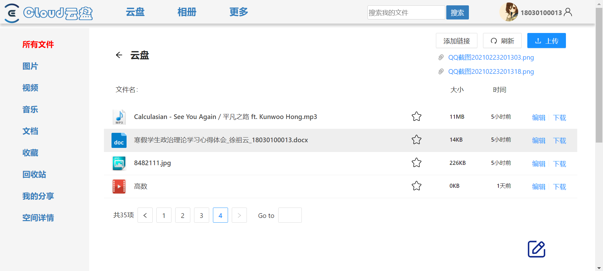

# 云盘后端
使用express快速实现的一个简单云盘，仅供学习使用～


## Quick Start

```shell
# 导入mysql数据库结构
create table cloud
use cloud
source ./cloud.sql

#mysql账号密码，app.js中修改
var connection = mysql.createConnection({
  host:        'localhost',
  user:       'root',
  password:   '991030Xzy!',
  database:   'cloud'
});


#安装依赖
npm install

# 运行项目
$ node app.js # 开发环境
```

